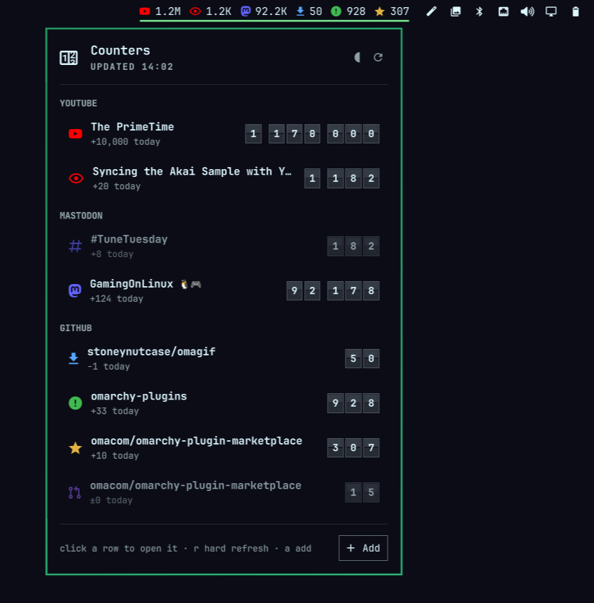
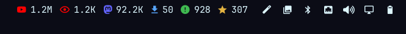
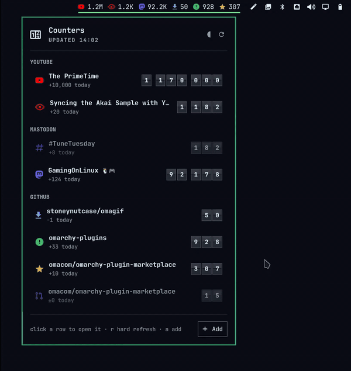
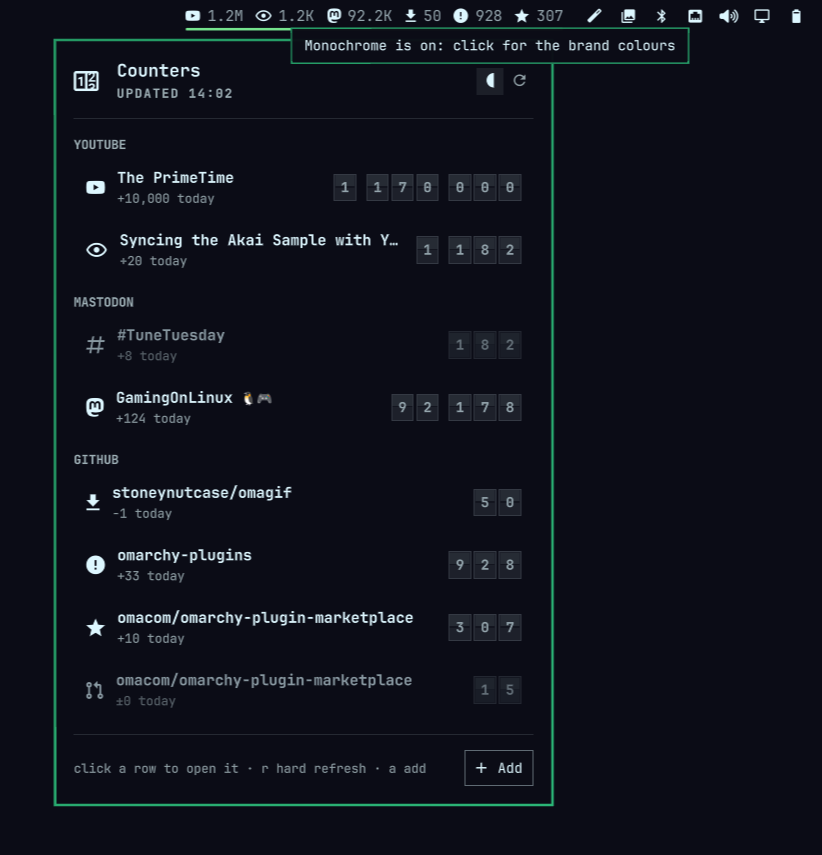
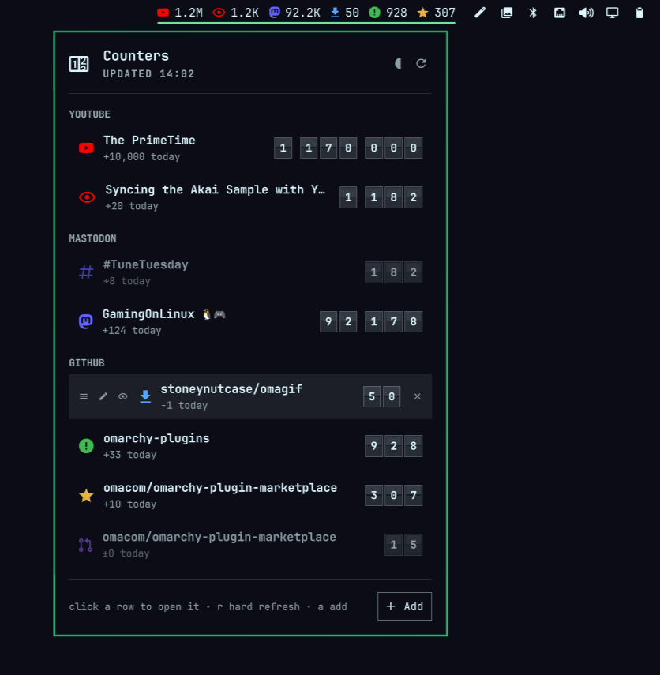

# Omacounter

Hit counters for the [Omarchy](https://omarchy.org/) bar. Remember the visitor
counter at the bottom of every home page? This is that, for the numbers you
care about today: YouTube channel subscribers, video likes and views, GitHub
stars, open issues, pull requests and unique cloners, Mastodon followers,
posts and hashtag activity, Discord server members and members online — and
more are coming, since every source is one small file.



The bar shows `󰗃 12.3K  󰔓 1.2K  󰓎 340  󰇚 51  󰫑 2.1K` in the order you
configured; the panel shows the exact numbers on a split-flap display,
grouped by service, with how much they moved today and this week, and a
click on a row opens the channel, video or repository. Opening the panel
refreshes and flips only the digits that changed since you last looked, leaf
by leaf; the first open and a hard refresh (`r`) count every card up from
zero.



In motion: a section dragged to the top, the row controls, a hard refresh
counting every card up from zero, and monochrome switched on:



## Requirements

- Omarchy 4.x
- `python3` — on a stock Omarchy
- For YouTube counters, a free [YouTube Data API v3](https://console.cloud.google.com/apis/library/youtube.googleapis.com)
  key. Setup walks you through it; it takes about two minutes and only reads
  public statistics. Mastodon and Discord counters and GitHub stars, issues
  and pull requests need nothing. GitHub unique cloners need a token that can read
  the repository; a logged-in `gh` CLI counts when it is the system package
  (`/usr/bin/gh`), so on most developer machines nothing has to be stored.

## Install

```bash
omarchy plugin add https://github.com/stoneynutcase/omacounter --enable
```

Then click the new `󰆙` on your bar and press **Add a counter**, or run setup
in a terminal:

```bash
~/.config/omarchy/plugins/stoneynutcase.omacounter/bin/omacounter setup
```

Setup adds counters one at a time: paste a link, and when it can be counted
more than one way (likes or views for a video, followers or posts for a
Mastodon account) pick which. The first time a counter needs a key, setup asks for it right there and
checks it. Each counter is verified against its service before it is saved.
Setup also offers to link the `omacounter` command into `~/.local/bin`.

## Adding counters

Three ways, pick whichever suits the moment:

**The panel.** Click the widget, then **Add** (or press `a`). It opens setup
in a floating terminal.

**The command line.** Anything the service accepts as an address works as the
target — a handle, a channel id, a video id, `owner/repo`, or the URL you just
copied. Give just the link and the type is inferred; a video asks whether to
count likes or views. Name the type to skip the question:

```bash
omacounter add https://youtu.be/dQw4w9WgXcQ                # asks: likes or views?
omacounter add @omarchy                                     # a channel: subscribers
omacounter add octocat/Hello-World                          # a repository: asks stars, issues, pull requests or cloners
omacounter add github.clones stoneynutcase/omagif           # a repository you can push to
omacounter add https://mastodon.social/@Gargron             # asks: followers or posts?
omacounter add mastodon.followers Gargron@mastodon.social
omacounter add https://mastodon.social/tags/TuneTuesday     # asks: posts or people this week?
omacounter add https://discord.gg/python                    # asks: members or online now?
omacounter add discord.members discord.gg/python            # a permanent invite link
omacounter add youtube.subscribers @omarchy
omacounter add youtube.likes https://www.youtube.com/watch?v=dQw4w9WgXcQ
omacounter add github.stars https://github.com/octocat/Hello-World
omacounter add youtube.likes https://youtu.be/dQw4w9WgXcQ --label "Rick" --color accent --style long
omacounter add youtube.subscribers @omarchy --glyph-color urgent --text-color "#7aa2f7"
omacounter list
omacounter set 1 glyphColor "#FF0000"     # YouTube red
omacounter set 1 label "The channel"
omacounter set 1 textColor ""             # back to the widget default
omacounter set 3 bar off                  # panel only; `bar on` puts it back
omacounter move 3 up                      # one place up within its group
omacounter move github top                # the whole GitHub section first
omacounter remove 2
```

`set` takes the counter's number from `list` or its target, then any key
from the table below; an empty value clears the key.

### Order

Counters are shown in one order everywhere, on the bar and in the panel:
sections by service in the order they were first added, and within each
section the counters in their configured order. A counter added later joins
its section. To change the order, hover a row in the panel and drag it by
the `󰍜` handle at its start; a row stays within its section. Hover a section
title and drag its handle to move the whole section. On the command line,
`move <n|target> up|down|top|bottom` moves a counter within its section and
`move <youtube|github|mastodon|discord> up|down|top|bottom` moves a section. The
numbers `list` prints, and that `set`, `move` and
`remove` take, are positions in this order, and any change the command line
makes stores the list in it, so `shell.json` ends up reading the way the
panel does.

**By hand.** Counters are plain objects on the widget's entry in
`~/.config/omarchy/shell.json`, which the shell reloads on save:

```json
{
  "id": "stoneynutcase.omacounter",
  "refreshMinutes": 15,
  "style": "short",
  "counters": [
    { "type": "youtube.subscribers", "target": "@omarchy" },
    { "type": "youtube.likes", "target": "dQw4w9WgXcQ", "label": "Rick", "glyphColor": "urgent", "textColor": "accent", "style": "long", "interval": 60 },
    { "type": "github.stars", "target": "octocat/Hello-World" }
  ]
}
```

### Per counter

Only `type` and `target` are required. `add` and setup also write the
source's default `icon` and brand `glyphColor` onto the counter, so they sit
in the file where you can tweak them; an empty value (`set 1 icon ""`) goes
back to the source's default, and `omacounter fill` writes them onto
counters added before this.

| Key | Meaning |
| --- | --- |
| `type` | `youtube.subscribers`, `youtube.likes`, `youtube.views`, `github.stars`, `github.issues`, `github.pulls`, `github.clones`, `mastodon.followers`, `mastodon.posts`, `mastodon.tag`, `mastodon.tagpeople`, `discord.members`, `discord.online` (`omacounter types` lists them with what each needs) |
| `target` | the channel (`@handle`, `UC…` id or URL), the video (id or URL), the repository (`owner/repo` or URL), the account (`user@instance` or profile URL), the tag (`#tag@instance` or tag URL), or the Discord invite link (`discord.gg/<code>`, a permanent one) |
| `label` | name in the panel and tooltip; defaults to the channel, video, repository, account or tag name. `omacounter set 1 label "…"`, or the 󰏫 on the panel row |
| `style` | `short` (12.3K) or `long` (12,345) on the bar; defaults to the widget's `style` |
| `color` | glyph and number together: `foreground` (default), `accent`, `urgent`, `muted`, or `#rrggbb`; theme roles follow the theme. Setting it drops the counter's `glyphColor` and `textColor` |
| `glyphColor` | the glyph on its own, same values; beats `color`. Unset, a source's brand colour applies (YouTube red) |
| `textColor` | the number on its own, same values; beats `color` |
| `interval` | minutes between fetches for this counter; defaults to the widget's `refreshMinutes`, and can never go below the source's rate cap (see `types`) |
| `icon` | glyph before the number; defaults per type (󰗃 subscribers, 󰔓 likes, 󰛐 views, 󰓎 stars, 󰀨 issues, 󰓂 pull requests, 󰇚 cloners, 󰫑 Mastodon account, 󰐣 Mastodon tag, 󰙯 Discord) |
| `bar` | `false` keeps the counter off the bar; it stays in the panel, dimmed. `omacounter set 3 bar off`, or the 󰛐 on the panel row |

### Widget settings

These sit next to `counters` on the same entry and are also editable from
Omarchy's plugin settings or `omarchy bar set stoneynutcase.omacounter <key> <value>`.

| Key | Default | Meaning |
| --- | --- | --- |
| `refreshMinutes` | 15 | fetch interval for counters without their own |
| `style` | `short` | number style on the bar for counters without their own |
| `barMode` | `all` | `all` side by side, or `cycle` one at a time |
| `cycleSeconds` | 5 | seconds per counter in cycle mode |
| `maxBarItems` | 0 | cap on counters shown in the bar (0 = all), counted in panel order; the panel shows every one |
| `barMaxWidth` | 480 | width budget in px for the counters on the bar; what does not fit collapses into a `+N` chip whose tooltip lists the rest (0 = no limit) |
| `glyphColor` | `""` | default glyph colour for counters without their own or a brand colour (empty = bar foreground) |
| `textColor` | `""` | default number colour for counters without their own (empty = bar foreground) |
| `monochrome` | `false` | `true` drops every brand and per-counter colour, on the bar and in the panel: glyphs take `glyphColor` (the bar foreground unless set) and numbers `textColor`, or a shade dimmer than the glyphs when that is unset so the two still read apart. `omarchy bar set stoneynutcase.omacounter monochrome true --json`, or the `󱎕` in the panel's header |



## Using it

| Where | Action |
| --- | --- |
| bar, left click | open the panel |
| bar, middle click | refresh now |
| bar, right click | notification with every counter |
| bar, hover a counter | its own tooltip with the exact number and today's change; a name longer than 40 characters is cut with an ellipsis |
| panel, click a row | open the channel, video or repository |
| panel, hover a row | at its start: drag `󰍜` to reorder it within its section, `󰏫` renames it in place (Enter saves, Esc cancels, empty restores the default name), `󰛐` hides it from the bar or shows it again; at its end: `󰅖` removes it, after confirming |
| panel, hover a section title | drag `󰍜` to move the whole section |
| panel, `r` | hard refresh: every card resets to zero and counts up to the fresh number |
| panel, `󱎕` in the header | toggle monochrome (see the widget setting below) |
| panel, `a` / `Esc` | add / close |



Numbers stay on screen when a fetch fails; the row says why, in the theme's
urgent colour, and when it will try again (two minutes later, or the
source's rate cap if that is longer), and the bar dims that counter until
the next successful fetch. A counter that has never fetched shows `–` on
the bar and `?` in the panel. The panel keeps a daily
history so it can show "+12 today · +80 this week" once it has seen a
counter for a day.

## Rate caps

Every source declares how often it may be polled, and that cap holds whatever
a counter or the widget asks for — a hard refresh inside the cap shows the
cached number and says when the next fetch is. `omacounter types` prints
each cap and why:

- **YouTube**: at most every minute. Each fetch of one counter costs one unit
  of the 10,000 the API grants per day; five counters every 15 minutes is 480
  units a day.
- **GitHub stars, issues, pull requests**: at most every 5 minutes. Without a
  token GitHub allows 60 requests an hour per IP address, and the search
  endpoint behind issues and pull requests 10 a minute; with a token, 5,000
  an hour and 30 a minute.
- **GitHub unique cloners**: at most every 15 minutes, hourly by default;
  GitHub updates traffic about once a day, and the number is a rolling
  14-day window like GitHub's own Insights → Traffic page.
- **Mastodon**: at most every 5 minutes. A default instance allows 300
  requests per 5 minutes per IP, but it is somebody's server; be polite.
- **Discord**: at most every 5 minutes. The invite route answers without a
  token and publishes no limits; Discord itself refreshes the counts about
  once a minute, so asking more often buys nothing.

The Mastodon tag types and Discord's online count are the exceptions to "a
number that only goes up": an instance publishes a tag's last seven days,
so posts-this-week and people-this-week are a rolling window and drop as
days fall off the back, and members online rises and falls with the day.
The flip display handles that the way a real one would, by rolling forward
past 9.

## Command line

```
omacounter setup                   guided: counters, the keys they need, put the widget on the bar
omacounter add <link>              add one, asking what to count when the link allows several
omacounter add <type> <target>     add one with the type given (--label, --style, --color, --glyph-color, --text-color, --interval, --icon)
omacounter set <n|target> <key> <value>
                                        change one setting; "" clears it
omacounter move <n|target|group> up|down|top|bottom
                                        reorder a counter within its section, or a whole section
omacounter remove <n|target>       remove one
omacounter list                    the counters, their last values and how often each fetches
                                        (own: the counter's interval; source: the type's default; cap: raised to the rate cap)
omacounter fill                    write each counter's default glyph and colours into shell.json
omacounter open <n|target>         open a counter's page
omacounter auth                    the stored keys and tokens, and who uses them
omacounter auth <id> set|show|check|clear
                                        `set` prompts for the value, or reads it with --stdin; never from the command line
omacounter key …                   alias for `auth youtube …`
omacounter doctor [--online]       what is wrong, if anything
omacounter types                   the counter types: target, what they need, rate cap
omacounter install                 link omacounter into ~/.local/bin
```

Keys and tokens live in `~/.config/omacounter/secrets.json` (mode 600),
one entry per credential, never in `shell.json`, so a dotfiles repo cannot
leak them. `YOUTUBE_API_KEY` and `GITHUB_TOKEN` in the environment work too,
and for GitHub the system's `gh` CLI is asked for its login when nothing
else is set (`gh auth token | omacounter auth github set --stdin` stores it
when `gh` is installed elsewhere).

## More sources

Every counter type is one small Python file in `providers/` filling a
documented contract: what it accepts as a target, its glyph and colours, the
credential it needs, how often it may be polled, how it fetches, what its
tooltip says. Drop a file in and it is discovered. [DEVELOPING.md](DEVELOPING.md)
shows how; Bluesky followers and GitHub followers are the obvious next ones.
X is possible but needs a developer account, four secrets and a paid tier for
anyone's followers but your own, which is why it is not here.

## What it touches

A widget that holds an API key and talks to the internet every few minutes
should say exactly how far it reaches. In full:

- **Network** — only the services behind the counters you configured:
  `www.googleapis.com` for YouTube, `api.github.com` for GitHub,
  `discord.com` for Discord, and for Mastodon the instance named in the
  counter. Every request is https to a
  fixed address built by the source's own file; a redirect is followed only
  to another https address, three hops at most; answers are capped at one
  megabyte and ten seconds. No analytics, no telemetry, no other host.
- **Your keys** — written to `~/.config/omacounter/secrets.json`, mode 600,
  read from there or from the environment, and never taken from a command
  line: `auth … set` prompts or reads stdin. YouTube authenticates with a
  query parameter, so the key travels in the request URL; the request is
  made in-process, so it never appears in `ps` or `/proc`, and every
  credential is scrubbed from whatever a service says back before it can
  reach the panel, the report or a log. GitHub's token goes in a header.
- **The programs it runs** — `python3` for the CLI, `gh` for a token,
  `gum` for the wizard's prompts, `xdg-open` for a counter's page, and
  Omarchy's own commands: each by absolute path out of `/usr/local/bin`,
  `/usr/bin`, `/bin` or Omarchy's install directory, and only when root owns
  it and nobody else can write it. `PATH` is replaced rather than consulted.
  The panel starts the CLI with the shell's environment cleared and only the
  locale, your home and XDG directories, proxy settings and the credential
  variables handed over. `omacounter doctor` says so if a helper is installed
  somewhere it will not run from.
- **Installing** — Omacounter installs no packages and asks for no
  privileges. It writes outside its own directory only with your say-so:
  putting the widget on the bar (`setup` and `add` ask first), the
  `~/.local/bin/omacounter` link (`install`, which will not replace a file it
  did not put there unless you pass `--force`), and the counters and settings
  on its own entry in `~/.config/omarchy/shell.json`, which the panel and the
  command line edit through the shell's own settings path.
- **Your files** — reads and writes `~/.config/omacounter/secrets.json`,
  `~/.local/state/omacounter/state.json` (the cache and daily history), and
  its entry in `shell.json`. Each write lands in a randomly named file in the
  same directory and is renamed into place, and the secrets and the cache
  are never read through a symlink.

## Removing it

```bash
omarchy plugin remove stoneynutcase.omacounter --yes
rm -rf ~/.config/omacounter ~/.local/state/omacounter   # your keys and the cache
rm -f ~/.local/bin/omacounter                            # if you ran `install`
```

Removing the plugin takes its entry, counters included, off the bar layout
in `shell.json`. Nothing else was written anywhere.

## License

MIT — see [LICENSE](LICENSE).
